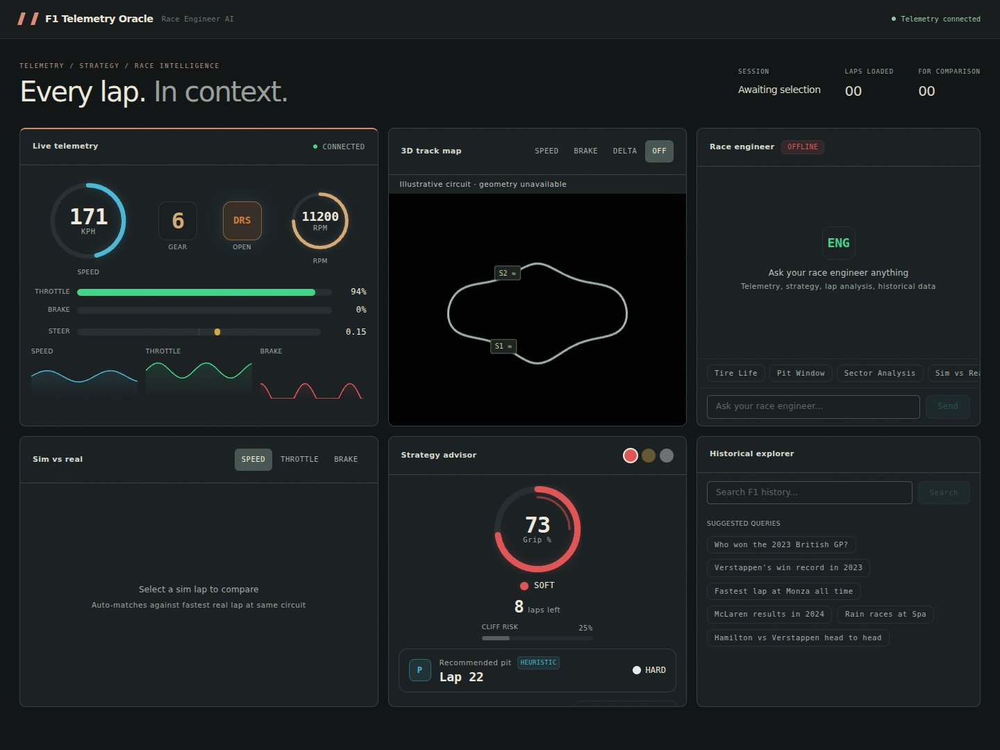
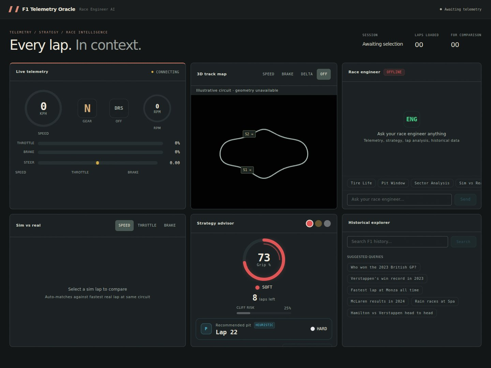
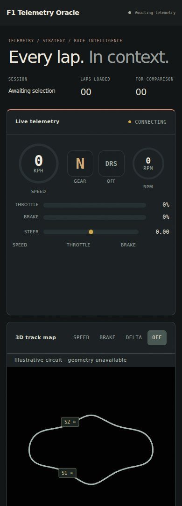

# F1 Telemetry Oracle -- AI Race Engineer

AI-powered F1 race engineer that compares your sim telemetry to real F1 data, backed by **Oracle Database 23ai Free** with Vector Search, Spatial, JSON Duality Views, and in-database ONNX models.

## Race control, redesigned

A readable six-panel race desk with responsive layouts, a connection-aware header, clearer telemetry traces, and in-browser track labels that no longer require a font CDN. The chat panel scrolls its own history without moving the dashboard.



<details><summary>Waiting for telemetry · mobile race desk</summary>




</details>

Actual browser captures with synthetic telemetry. The fallback circuit is labeled illustrative, sector markers are approximate, and the strategy panel shows its existing heuristic fallback. These are not live laps or database predictions. [Visual notes](docs/visuals/README.md).

## Architecture

```
DATA SOURCES                              ORACLE DATABASE 23ai FREE
                                           +---------------------------------+
  F1 24/25 Game (UDP) ----+                | JSON Relational Duality Views   |
  OpenF1 API (2023-25) ---+--> Collectors  | AI Vector Search (384-dim)      |
  Ergast API (1950-25) ---+    & Normalizer| In-DB ONNX Models               |
                                     |     | Oracle Spatial (track geometry)  |
                                     v     +---------------------------------+
                               FastAPI Backend (REST + WebSocket)
                                     |
                                     v
                               Next.js 14 Dashboard
                               +--------------------+--------------------+
                               | Live Telemetry     | AI Race Engineer   |
                               | (speed, throttle,  | Chat (RAG-powered) |
                               | brake, steering)   |                    |
                               +--------------------+--------------------+
                               | 3D Track Map       | Sim vs Real        |
                               | (Three.js)         | Comparison         |
                               +--------------------+--------------------+
                               | Strategy Advisor   | Historical         |
                               | (tire + pit ONNX)  | Explorer           |
                               +--------------------+--------------------+
```

## Features

| Panel | Description |
|-------|-------------|
| **Live Telemetry** | Real-time speed, throttle, brake, steering via WebSocket from F1 24/25 UDP feed |
| **AI Race Engineer** | Agentic tool-calling engineer — the LLM plans its own retrieval over 8 database tools (laps, telemetry, comparison, tire ONNX, pit strategy, vector search, semantic docs, setup). Falls back to classic SQL + vector + graph RAG. Every answer carries a transparency trace |
| **3D Track Map** | Circuit visualization with Three.js -- car positions and telemetry heatmap overlays |
| **Sim vs Real** | Overlay your F1 game telemetry against real-world F1 data, aligned by track distance |
| **Driving Twin** | "Who do I drive like?" — per-sector telemetry embeddings scored by Oracle AI Vector Search match your lap to the real driver whose style it most resembles |
| **Strategy Advisor** | Tire degradation and pit window scored by in-database ONNX models + a Monte Carlo race simulator (10,000s of races) that ranks pit strategies by win probability |
| **Historical Explorer** | Natural language search over 75 years of F1 history from Ergast + OpenF1 |

## Oracle 23ai Features Used

| Feature | Usage |
|---------|-------|
| **JSON Relational Duality Views** | Write telemetry as JSON documents, query relationally -- zero impedance mismatch |
| **AI Vector Search** | 384-dim lap + per-sector embeddings with cosine distance for semantic similarity search |
| **In-Database ONNX** | Tire grip + remaining-life regression models **and** the all-MiniLM-L12-v2 text embedding model run inside the DB — `PREDICTION()` and `VECTOR_EMBEDDING()` do the ML, not Python |
| **In-Database Text RAG** | `race_documents` knowledge base embedded and searched entirely in SQL with `VECTOR_EMBEDDING()` |
| **Oracle Spatial** | Track geometry (SDO_GEOMETRY), haversine distance queries, circuit coordinate storage |
| **JSON Document Store** | Weather data, car setup configs, and race event payloads stored as native JSON |

## Quickstart

<!-- one-command-install -->
> **One-command install**: clone, configure, and run in a single step:
>
> ```bash
> curl -fsSL https://raw.githubusercontent.com/jasperan/f1-telemetry-oracle/feat/race-engineer-ai/install.sh | bash
> ```
>
> <details><summary>Advanced options</summary>
>
> Override install location:
> ```bash
> PROJECT_DIR=/opt/myapp curl -fsSL https://raw.githubusercontent.com/jasperan/f1-telemetry-oracle/feat/race-engineer-ai/install.sh | bash
> ```
>
> Or install manually:
> ```bash
> git clone https://github.com/jasperan/f1-telemetry-oracle.git
> cd f1-telemetry-oracle
> # See below for setup instructions
> ```
> </details>


```bash
# Clone and start everything
git clone https://github.com/jasperan/f1-telemetry-oracle.git
cd f1-telemetry-oracle
docker compose up --build

# Services:
#   Frontend:  http://localhost:3100
#   API:       http://localhost:8100
#   API docs:  http://localhost:8100/docs  (Swagger UI)
#   Oracle:    localhost:1525/FREEPDB1
```

### Seed Historical Data

```bash
# Seed circuit geometry and spatial data
docker compose exec api python scripts/seed_circuits.py

# Load ONNX models into Oracle (tire grip + laps + MiniLM text embedding)
# Downloads the augmented all-MiniLM-L12-v2 model on first run (~117 MB)
docker compose exec api python scripts/load_onnx_models.py

# Seed the RAG knowledge base (setup guides, strategy, circuit notes, history)
# Documents are embedded IN the database via VECTOR_EMBEDDING()
docker compose exec api python scripts/seed_race_documents.py
```

### Connect F1 24/25 Game

1. In game settings, set UDP telemetry to `<your-machine-ip>:20777`
2. The UDP collector starts automatically with `docker compose up`
3. Live telemetry appears on the dashboard in real-time

## Development Setup

### Prerequisites

- Docker + Docker Compose
- Python 3.12+ (uv recommended)
- Node.js 20+
- Ollama with `qwen3.5:35b-a3b` (for AI race engineer)

### Backend

```bash
# Install Python dependencies (uv manages the project venv from uv.lock)
pip install uv
uv sync --extra dev

# Start Oracle 23ai Free
docker compose up oracle-26ai -d

# Apply schema
python -c "
import asyncio
from api.services.oracle import OraclePool
from pathlib import Path

async def main():
    pool = OraclePool(dsn='localhost:1525/FREEPDB1', user='f1app', password='f1app')
    await pool.open()
    await pool.execute_script(Path('api/db/schema.sql').read_text())
    await pool.close()

asyncio.run(main())
"

# Run API server
uvicorn api.main:app --reload --host 0.0.0.0 --port 8100
```

### Frontend

```bash
cd frontend
npm install
npm run dev    # http://localhost:3000
```

### Ollama (AI Race Engineer)

```bash
ollama pull qwen3.5:35b-a3b
ollama serve   # or use the Ollama container in docker-compose
```

## Testing

```bash
# Unit tests (fast, no external deps)
uv run pytest tests/unit/ -v

# Integration tests (requires Oracle container; DSN overridable via ORACLE_TEST_DSN)
# WARNING: the integration suite drops and recreates all tables in the target
# database — point it at a dedicated container, and re-run
# scripts/load_onnx_models.py + scripts/seed_race_documents.py afterwards.
uv run pytest tests/integration/ -v -m integration

# Frontend build verification
cd frontend && npm run build

# E2E tests (requires full stack running)
cd tests/e2e && npm install && npx playwright test
```

## API Reference

Interactive API docs are available at `http://localhost:8100/docs` (Swagger UI) when the API server is running.

### Key Endpoints

| Endpoint | Method | Description |
|----------|--------|-------------|
| `/api/circuits` | GET | List all circuits with track metadata |
| `/api/drivers` | GET | List drivers (filterable by nationality, sim player) |
| `/api/sessions` | GET | List sessions (filterable by source, circuit, season) |
| `/api/sessions/{id}` | GET | Session detail |
| `/api/laps` | GET | List laps (filterable by session, driver) |
| `/api/laps/{id}` | GET | Lap detail with sector times |
| `/api/laps/{id}/telemetry` | GET | Paginated telemetry frames (cursor-based) |
| `/api/laps/{id}/similar` | GET | Vector similarity search for similar laps |
| `/api/compare/laps?ids=a,b` | GET | Compare two laps with distance-aligned telemetry deltas |
| `/api/compare/sim-vs-real` | GET | Auto-match sim lap to best real-world lap and compare |
| `/api/compare/driving-twin?lap_id=X` | GET | Per-sector driving-style match — which real driver you drive like |
| `/api/predict/tire-life` | POST | In-database ONNX tire degradation prediction |
| `/api/predict/pit-window` | POST | In-database ONNX optimal pit window prediction |
| `/api/predict/strategy-sim` | POST | Monte Carlo race simulator — ranked pit strategies with win probability |
| `/api/chat/message` | POST | Agentic (tool-calling) AI race engineer chat, with RAG fallback + retrieval trace |
| `/ws/live` | WebSocket | Real-time telemetry stream |
| `/ws/chat` | WebSocket | Streaming chat responses |
| `/health` | GET | Health check |

## Terminal UI (Go)

`gotui/` is an additional way to run this project: a terminal console built on
[charm.land/bubbletea/v2](https://github.com/charmbracelet/bubbletea) with
`huh` forms. It is a read-only peer of the Next.js dashboard and talks to the
same FastAPI service, so a terminal user and a browser user see identical
numbers -- it holds no telemetry, comparison or strategy logic of its own.

The compare view is the centrepiece: the sector table comes from the recorded
sector times, and the distance-segment panel is derived from the service's
distance-aligned speed deltas. The two are labelled differently on purpose,
because only the first is real elapsed time.

```bash
cd gotui && go build -o f1-telemetry-tui ./cmd/f1-telemetry-tui

# Full-screen UI (needs a terminal; the API must be running)
./f1-telemetry-tui
./f1-telemetry-tui --base-url http://127.0.0.1:8100
./f1-telemetry-tui --start-service          # launch the API first, then connect

# One-shot, pipeable actions
./f1-telemetry-tui --health
./f1-telemetry-tui --circuits
./f1-telemetry-tui --sessions --source sim
./f1-telemetry-tui --laps --session sim_2025_bahrain_r
./f1-telemetry-tui --compare sim_2025_bahrain_l12,real_2025_bahrain_l12
./f1-telemetry-tui --sim-vs-real sim_2025_bahrain_l12
./f1-telemetry-tui --driving-twin sim_2025_bahrain_l12
./f1-telemetry-tui --strategy-sim --laps-total 53 --track-temp 31
./f1-telemetry-tui --ask "where am I losing time?"

# Machine-readable
./f1-telemetry-tui --compare A,B --json
```

In the full-screen UI: arrows move, `enter` opens, `esc` goes back, `q` quits.
On the Laps screen `c` picks a lap and `c` again compares the pair; `enter`
opens the driving-twin analysis for the highlighted lap.

Requires Go 1.25+ and a running API. If the API is not up you get the exact
commands to start it; if it is up but Oracle is not, the message says so
instead, because the two need different fixes. `ACCESSIBLE=1` selects plain
output: the embedded forms cannot serve a screen reader, so claiming otherwise
would be worse than falling back.

## Project Structure

```
f1-telemetry-oracle/
├── api/                        # FastAPI backend
│   ├── main.py                 # App factory with lifespan management
│   ├── config.py               # Pydantic settings (Oracle, Ollama, APIs)
│   ├── routers/                # Endpoint modules
│   │   ├── circuits.py         # Circuit CRUD
│   │   ├── drivers.py          # Driver CRUD
│   │   ├── sessions.py         # Session listing with filters
│   │   ├── laps.py             # Laps, telemetry, vector search
│   │   ├── compare.py          # Lap comparison, sim-vs-real
│   │   ├── predict.py          # Tire life + pit window (ONNX)
│   │   ├── chat.py             # RAG chat endpoint
│   │   └── ws.py               # WebSocket live telemetry + chat
│   ├── services/               # Business logic
│   │   ├── oracle.py           # Async connection pool
│   │   ├── ollama.py           # LLM client
│   │   └── rag.py              # Query understanding + context assembly
│   ├── models/                 # Pydantic schemas
│   │   └── schemas.py          # All request/response models
│   └── db/                     # Database DDL + shared SQL fragments
│       ├── columns.py          # Shared lap/frame column lists
│       ├── schema.sql          # Core 10-table schema
│       ├── vector.sql          # Vector search index setup
│       ├── spatial.sql         # Spatial geometry + indexes
│       └── duality_views.sql   # JSON Relational Duality Views
├── collectors/                 # Data ingestion pipelines
│   ├── normalizer.py           # Unified NormalizedLap/NormalizedFrame
│   ├── f1_udp/                 # F1 24 async UDP listener + packet decoder
│   ├── openf1/                 # Live polling + batch backfill
│   └── ergast/                 # Historical bulk collector
├── frontend/                   # Next.js 14 dashboard
│   ├── app/                    # Pages + layout (dark racing theme)
│   ├── components/             # 6 dashboard panels
│   └── lib/                    # WebSocket hook, Zustand store
├── gotui/                      # Go terminal UI (Bubble Tea v2 + huh)
│   ├── cmd/f1-telemetry-tui/    # flags, scripted actions, UI entry point
│   └── internal/               # api client, analysis, tui, session, huhstyle
├── scripts/                    # Seed + model loading utilities
├── tests/
│   ├── unit/                   # Fast tests, no external deps
│   ├── integration/            # Oracle container round-trip tests
│   ├── e2e/                    # Playwright dashboard E2E tests
│   └── fixtures/               # SQL seed data
├── .github/workflows/ci.yml   # GitHub Actions CI pipeline
├── docker-compose.yml          # Full stack: Oracle + Ollama + API + Frontend
└── pyproject.toml              # Python project config (hatch + ruff + pytest)
```

## Tech Stack

- **Database**: Oracle Database 23ai Free (Vector Search, Spatial, JSON Duality Views, ONNX)
- **Backend**: FastAPI, oracledb (async thin mode), Pydantic v2
- **Frontend**: Next.js 14, React 18, Recharts, Three.js (react-three-fiber), Zustand, Tailwind CSS
- **AI/LLM**: Ollama (Qwen 3.5 35B-A3B), RAG with vector + SQL + graph retrieval
- **Data Sources**: F1 24/25 UDP telemetry, OpenF1 API, Ergast API
- **Testing**: pytest + pytest-asyncio, Playwright, Vitest
- **CI/CD**: GitHub Actions (lint, test, build, integration, E2E)

## Credits

The original UDP packet deserialization is based on work by [chrishannam/Telemetry-F1-2021](https://github.com/chrishannam/Telemetry-F1-2021) and the [CodeMasters F1 2021 UDP specification](https://forums.codemasters.com/topic/80231-f1-2021-udp-specification/).

## License

MIT
